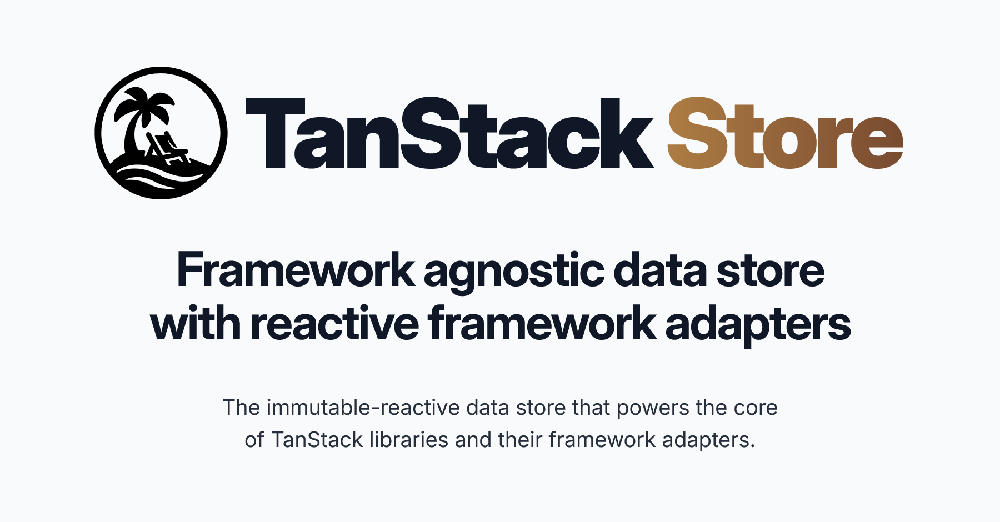

  

 

### [Become a Sponsor!](https://github.com/sponsors/tannerlinsley/)

# TanStack Store

An immutable, reactive data store with framework adapters that powers the core of the TanStack ecosystem.

- Fine‑grained updates for performant state management  
- Flexible primitives for building custom state logic  
- Works across frameworks like React, Solid, Vue, Angular & Svelte  
- Lightweight and standalone — use it in any app or as a library foundation

### <a href="https://tanstack.com/store">Read the docs →</b></a>

## Get Involved

- We welcome issues and pull requests!
- Participate in [GitHub discussions](https://github.com/TanStack/store/discussions)
- Chat with the community on [Discord](https://discord.com/invite/WrRKjPJ)
- See [CONTRIBUTING.md](./CONTRIBUTING.md) for setup instructions

## Partners

<table align="center">
  <tr>
    <td>
        
    </td>
    <td padding="20">
      
    </td>
  </tr>
  
</table>

We're looking for TanStack Query Partners to join our mission! Partner with us to push the boundaries of TanStack Query and build amazing things together.

<a href="mailto:partners@tanstack.com?subject=TanStack Query Partnership"><b>LET'S CHAT</b></a>

## Explore the TanStack Ecosystem

- <a href="https://github.com/tanstack/config"><b>TanStack Config</b></a> – Tooling for JS/TS packages
- <a href="https://github.com/tanstack/db"><b>TanStack DB</b></a> – Reactive sync client store
- <a href="https://github.com/tanstack/devtools"><b>TanStack DevTools</b></a> – Unified devtools panel
- <a href="https://github.com/tanstack/form"><b>TanStack Form</b></a> – Type‑safe form state
- <a href="https://github.com/tanstack/pacer"><b>TanStack Pacer</b></a> – Debouncing, throttling, batching  
- <a href="https://github.com/tanstack/query"><b>TanStack Query</b></a> – Async state & caching
- <a href="https://github.com/tanstack/ranger"><b>TanStack Ranger</b></a> – Range & slider primitives
- <a href="https://github.com/tanstack/router"><b>TanStack Router</b></a> – Type‑safe routing, caching & URL state
- <a href="https://github.com/tanstack/router"><b>TanStack Start</b></a> – Full‑stack SSR & streaming
- <a href="https://github.com/tanstack/table"><b>TanStack Table</b></a> – Headless datagrids
- <a href="https://github.com/tanstack/virtual"><b>TanStack Virtual</b></a> – Virtualized rendering

… and more at <a href="https://tanstack.com"><b>TanStack.com »</b></a>

<!-- Use the force, Luke! -->
